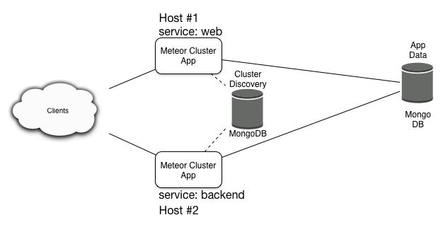

Meteor Cluster Test
===================

Sample application(s) to test [meteor
cluster](https://github.com/meteorhacks/cluster)

Prerequisites and architecture
------------------------------

Using this cluster test assumes a setup of

-   A MongoDB server
-   2 Ubuntu hosts

Both Meteor servers can be accessed.

MongoDB setup
-------------

We'll need three databases, one for communication between the nodes
(`cluster`) and two for the app (`data` and `oplog`).

Create the MongoDB users accordingly.

    use cluster;
    db.createUser({
      "user": "clusteruser",
      "pwd": "password",
      "roles": [{
        role: "readWrite",
        db: "cluster"
      }]
    });

    use data;
    db.createUser({
      "user": "datauser",
      "pwd": "password",
      "roles": [{
        role: "readWrite",
        db: "data"
      }]
    });

    use admin;
    db.createUser({
      user: 'oplog',
      pwd: 'password',
      roles: [{  
        role: "read",
        db: "local"
      }]
    });

App servers
-----------

The `meteorhacks:cluster` package adds cluster abilities to the
application.

TODO: More info

Balancers
---------

TODO: Instances that are only acting as balancers, to distribute traffic
between all app servers.

In order to make an instance a balancer set the `CLUSTER_BALANCER_URL`
environment variable.

    export CLUSTER_BALANCER_URL=https://subdomain.domainname.com

Running a simple cluster
------------------------

Adjust all environment variables in the `mup.json` file according to
your environment. Then issue the commands

    mup setup

and

    mup deploy

Questions
---------

-   Are all balancers also acting as app servers? Can this be avoided?
-   Errors from the `backend` service:
    `stream error Network error: ws://192.168.2.70:3000/websocket: connect ECONNREFUSED` -
    Is this because the .70 server is not a `web` service?
-   Can I configure `mup.json` so that each host may get another
    application (`app`) source? (A first test showed *no*)
- How can we get SSL added in the most efficient way?
